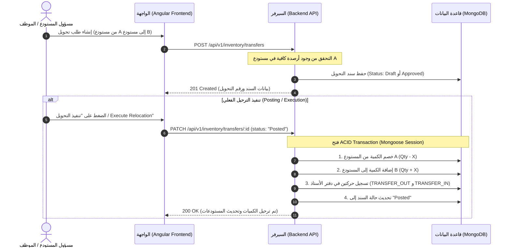

# دليل ومواصفات التكامل لعمليات التحويل المخزني (Stock Transfers Backend Specification)
## PetroFlow ERP | Inventory Relocation & Stock Balancing Engine

---

## 1. الملخص التنفيذي والمشاكل الحالية (Executive Summary & Problem Statement)

عند قيام المستخدم بإجراء تحويل مواد بين مستودعين عبر الواجهة الأمامية (`POST /api/v1/inventory/transfers`)، تظهر مشكلتان جوهريتان في الباك إند:

1. **التحويلات لا تُحفظ أو لا تظهر بعد التحديث (Persistence & Retrieval Failure):**
   - عند طلب قائمة التحويلات عبر:
     ```http
     GET /api/v1/inventory/transfers?limit=200
     ```
     يرجع السيرفر إما مصفوفة فارغة `[]` أو بيانات لا تطابق ما تم إرساله، مما يؤدي لاختفاء التحويل بعد إعادة تحميل الصفحة (Refresh).
2. **التحويل لا ينعكس على أرصدة المستودعات (No Stock Balance Deduction/Addition):**
   - عند تحويل صنف من المستودع (أ) إلى المستودع (ب)، **لا يتم خصم الكمية من المستودع المصدر**، و**لا يتم إضافة الكمية إلى المستودع الوجهة**.
   - تظل كمية الصنف في المستودعين كما هي دون أي تغيير، كما لا يتم إنشاء حركات في دفتر أستاذ المخزون (`Item Ledger`).

---

## 2. دورة حياة التحويل المخزني (Transfer Lifecycle Workflow)

يمر التحويل المخزني بدورة حياة واضحة لضمان الرقابة والتدقيق الداخلي:



---

## 3. المخطط البياني لقاعدة البيانات (Mongoose Schema & Models)

### أ) مخطط سند التحويل (`InternalTransfer Schema`)

```typescript
import { Schema, model, Document, Types } from 'mongoose';

export interface ITransferItem {
  item?: Types.ObjectId;       // مرجع الصنف في جدول الأصناف الرئيسي
  itemCode: string;            // كود الصنف (e.g. 'PIPE-CS-001')
  itemName: string;            // اسم الصنف
  quantity: number;            // الكمية المحولة (يجب أن تكون > 0)
  uom: string;                 // وحدة القياس (PCS, MTR, BOX, etc.)
  unitPrice?: number;          // سعر الوحدة التقديري
  totalPrice?: number;         // إجمالي القيمة
}

export interface IInternalTransfer extends Document {
  transferNumber: string;      // رقم السند الفريد (e.g. 'TRF-2026-0001')
  fromWarehouse: Types.ObjectId; // مستودع المصدر (من)
  toWarehouse: Types.ObjectId;   // مستودع الوجهة (إلى)
  transferDate: Date;          // تاريخ التحويل
  requestedBy: string;         // اسم أو ID مقدم الطلب (مطلوب)
  approvedBy?: string;         // معتمد التحويل
  status: 'Draft' | 'Pending Approval' | 'Approved' | 'Posted' | 'Cancelled';
  reason?: string;             // سبب التحويل
  items: ITransferItem[];      // قائمة الأصناف
  notes?: string;
  createdAt: Date;
  updatedAt: Date;
}

const TransferItemSchema = new Schema<ITransferItem>({
  item: { type: Schema.Types.ObjectId, ref: 'InventoryItem', required: false },
  itemCode: { type: String, required: true, trim: true },
  itemName: { type: String, required: true, trim: true },
  quantity: { type: Number, required: true, min: [0.0001, 'Quantity must be greater than zero'] },
  uom: { type: String, default: 'PCS' },
  unitPrice: { type: Number, default: 0 },
  totalPrice: { type: Number, default: 0 }
}, { _id: false });

const InternalTransferSchema = new Schema<IInternalTransfer>({
  transferNumber: { 
    type: String, 
    required: true, 
    unique: true, 
    trim: true,
    index: true 
  },
  fromWarehouse: { 
    type: Schema.Types.ObjectId, 
    ref: 'Warehouse', 
    required: [true, 'Source warehouse is required'] 
  },
  toWarehouse: { 
    type: Schema.Types.ObjectId, 
    ref: 'Warehouse', 
    required: [true, 'Destination warehouse is required'] 
  },
  transferDate: { type: Date, default: Date.now },
  requestedBy: { type: String, required: [true, 'requestedBy is required'] },
  approvedBy: { type: String },
  status: { 
    type: String, 
    enum: ['Draft', 'Pending Approval', 'Approved', 'Posted', 'Cancelled'], 
    default: 'Draft',
    index: true 
  },
  reason: { type: String, default: '' },
  items: { 
    type: [TransferItemSchema], 
    validate: [(val: ITransferItem[]) => val.length > 0, 'Transfer must include at least one item'] 
  },
  notes: { type: String }
}, { timestamps: true });

export const InternalTransfer = model<IInternalTransfer>('InternalTransfer', InternalTransferSchema);
```

---

## 4. المنطق البرمجي الحرج لتحديث المخزون (Atomic Stock Balance Update)

> [!IMPORTANT]
> **شرط الجودة:** يجب تنفيذ تحديث الأرصدة داخل **ACID Transaction Session** لمنع أي تضارب أو أخطاء حسابية (Race Conditions).

### متى يتم تعديل المخزون؟
- **إما:** مباشرة عند إنشاء السند إذا كان الـ status المرسل `Posted` أو `Approved`.
- **أو:** عند استدعاء نقطة النهاية: `PATCH /api/v1/inventory/transfers/:id` مع `{ status: 'Posted' }`.

### خطوات الترحيل في الداتابيز:
```typescript
async function executeStockTransfer(transferId: string, userId: string) {
  const session = await mongoose.startSession();
  session.startTransaction();

  try {
    const transfer = await InternalTransfer.findById(transferId).session(session);
    if (!transfer) {
      throw new Error('Transfer record not found');
    }
    if (transfer.status === 'Posted') {
      throw new Error('Transfer has already been posted and executed.');
    }

    const { fromWarehouse, toWarehouse, items } = transfer;

    if (fromWarehouse.toString() === toWarehouse.toString()) {
      throw new Error('Source and destination warehouses cannot be identical.');
    }

    for (const line of items) {
      // 1. التحقق من الرصيد المتوفر في المستودع المصدر
      const sourceItem = await InventoryItem.findOne({
        warehouseId: fromWarehouse,
        itemCode: line.itemCode
      }).session(session);

      if (!sourceItem || sourceItem.quantity < line.quantity) {
        throw new Error(`Insufficient stock for item ${line.itemCode} in source warehouse. Available: ${sourceItem ? sourceItem.quantity : 0}, Requested: ${line.quantity}`);
      }

      // 2. خصم الكمية من المستودع المصدر
      await InventoryItem.updateOne(
        { _id: sourceItem._id },
        { 
          $inc: { quantity: -line.quantity },
          $set: { updatedAt: new Date() }
        },
        { session }
      );

      // 3. إضافة الكمية إلى المستودع الوجهة (أو إنشاء سجل إذا كان الصنف غير موجود في هذا المستودع سابقاً)
      let destItem = await InventoryItem.findOne({
        warehouseId: toWarehouse,
        itemCode: line.itemCode
      }).session(session);

      if (destItem) {
        await InventoryItem.updateOne(
          { _id: destItem._id },
          { 
            $inc: { quantity: line.quantity },
            $set: { updatedAt: new Date() }
          },
          { session }
        );
      } else {
        // إنشاء الصنف في المستودع الجديد
        await InventoryItem.create([{
          itemCode: line.itemCode,
          itemName: line.itemName,
          category: sourceItem.category,
          uom: line.uom || sourceItem.uom,
          quantity: line.quantity,
          minQuantity: sourceItem.minQuantity || 5,
          unitPrice: sourceItem.unitPrice || 0,
          warehouseId: toWarehouse,
          status: 'In Stock',
          location: ''
        }], { session });
      }

      // 4. قيد الحركات في دفتر أستاذ المخزون (Item Ledger / Stock Movements)
      await ItemLedger.create([
        {
          itemCode: line.itemCode,
          warehouseId: fromWarehouse,
          transactionType: 'TRANSFER_OUT',
          referenceNumber: transfer.transferNumber,
          quantity: -line.quantity,
          balanceAfter: sourceItem.quantity - line.quantity,
          transactionDate: new Date(),
          requestedBy: transfer.requestedBy,
          notes: `Transferred to warehouse ${toWarehouse}`
        },
        {
          itemCode: line.itemCode,
          warehouseId: toWarehouse,
          transactionType: 'TRANSFER_IN',
          referenceNumber: transfer.transferNumber,
          quantity: line.quantity,
          balanceAfter: (destItem ? destItem.quantity : 0) + line.quantity,
          transactionDate: new Date(),
          requestedBy: transfer.requestedBy,
          notes: `Transferred from warehouse ${fromWarehouse}`
        }
      ], { session });
    }

    // 5. تحديث حالة السند
    transfer.status = 'Posted';
    transfer.approvedBy = userId;
    await transfer.save({ session });

    await session.commitTransaction();
    session.endSession();

    return transfer;
  } catch (error) {
    await session.abortTransaction();
    session.endSession();
    throw error;
  }
}
```

---

## 5. مواصفات نقاط النهاية (API Endpoints Specification)

### 1) إنشاء تحويل مخزني جديد:
- **المسار:** `POST /api/v1/inventory/transfers`
- **الـ Request Body المرسل من الـ Frontend:**
  ```json
  {
    "fromWarehouseId": "66da01f28b4d812345678901",
    "toWarehouseId": "66da01f28b4d812345678902",
    "transferDate": "2026-10-02",
    "requestedBy": "Ahmed Mahmoud",
    "reason": "Transfer requested by Ahmed Mahmoud",
    "items": [
      {
        "itemCode": "VALVE-GT-004",
        "itemName": "Gate Valve 4 inch Class 600",
        "quantity": 5,
        "uom": "PCS"
      }
    ]
  }
  ```
- **الـ Response المطلوب (201 Created):**
  ```json
  {
    "success": true,
    "statusCode": 201,
    "message": "Stock transfer created successfully",
    "data": {
      "_id": "6704b2a8d9a1120034a1b999",
      "transferNumber": "TRF-2026-0012",
      "fromWarehouseId": "66da01f28b4d812345678901",
      "toWarehouseId": "66da01f28b4d812345678902",
      "transferDate": "2026-10-02T00:00:00.000Z",
      "requestedBy": "Ahmed Mahmoud",
      "status": "Draft",
      "items": [
        {
          "itemCode": "VALVE-GT-004",
          "itemName": "Gate Valve 4 inch Class 600",
          "quantity": 5,
          "uom": "PCS"
        }
      ],
      "createdAt": "2026-10-02T10:30:00.000Z"
    }
  }
  ```

---

### 2) جلب قائمة التحويلات:
- **المسار:** `GET /api/v1/inventory/transfers?limit=200`
- **الـ Query Parameters المدعومة:**
  - `limit` (default: 50)
  - `page` (default: 1)
  - `status` (اختياري: `Draft`, `Posted`, إلخ)
  - `warehouseId` (اختياري)
  - `search` (بحث برقم السند أو اسم الصنف)
- **الـ Response المطلوب (200 OK):**
  ```json
  {
    "success": true,
    "statusCode": 200,
    "message": "Transfers retrieved successfully",
    "data": [
      {
        "_id": "6704b2a8d9a1120034a1b999",
        "transferNumber": "TRF-2026-0012",
        "fromWarehouseId": "66da01f28b4d812345678901",
        "toWarehouseId": "66da01f28b4d812345678902",
        "fromWarehouse": {
          "_id": "66da01f28b4d812345678901",
          "code": "WH-MAIN",
          "name": "Central Warehouse"
        },
        "toWarehouse": {
          "_id": "66da01f28b4d812345678902",
          "code": "WH-SITE",
          "name": "Site Rig 04 Store"
        },
        "transferDate": "2026-10-02T00:00:00.000Z",
        "requestedBy": "Ahmed Mahmoud",
        "status": "Posted",
        "items": [
          {
            "itemCode": "VALVE-GT-004",
            "itemName": "Gate Valve 4 inch Class 600",
            "quantity": 5,
            "uom": "PCS"
          }
        ],
        "createdAt": "2026-10-02T10:30:00.000Z"
      }
    ],
    "total": 1,
    "page": 1,
    "limit": 200
  }
  ```

---

### 3) اعتماد وترحيل التحويل (Approve & Execute Transfer):
- **المسار:** `PATCH /api/v1/inventory/transfers/:id`
- **الـ Request Body:**
  ```json
  {
    "status": "Posted"
  }
  ```
- **الـ Response المطلوب (200 OK):**
  ```json
  {
    "success": true,
    "statusCode": 200,
    "message": "Transfer executed and stock updated successfully",
    "data": {
      "_id": "6704b2a8d9a1120034a1b999",
      "transferNumber": "TRF-2026-0012",
      "status": "Posted",
      "updatedAt": "2026-10-02T10:35:00.000Z"
    }
  }
  ```

---

## 6. قائمة الفحص والتحقق للباك إند (Backend QA Checklist)

| # | البند المراد فحصه | النتيجة المتوقعة |
|---|-------------------|------------------|
| 1 | `POST /transfers` بحقول صالحة | إرجاع `201 Created` وتخزين المستند برقم تسلسلي تلقائي |
| 2 | `POST /transfers` بدون `requestedBy` | إرجاع خطأ `400` مع رسالة توضيحية للمستخدم |
| 3 | `GET /transfers?limit=200` بعد إنشاء سند | ظهور السند الجديد فوراً في المصفوفة دون فقدان |
| 4 | ترحيل السند (`status: 'Posted'`) | خصم رصيد الصنف من المستودع A وإضافته للمستودع B |
| 5 | محاولة تحويل كمية أكبر من الرصيد المتوفر في A | رفض العملية برسالة `400 Insufficient stock in source warehouse` وعدم حدوث أي تغيير جزئي |
| 6 | دفتر أستاذ المخزون (`Item Ledger`) | ظهور حركتي `TRANSFER_OUT` و `TRANSFER_IN` برقم السند |

---
*تم إعداد هذا المستند لمواءمة تكامل الباك إند مع الواجهة الأمامية لنظام PetroFlow ERP.*
