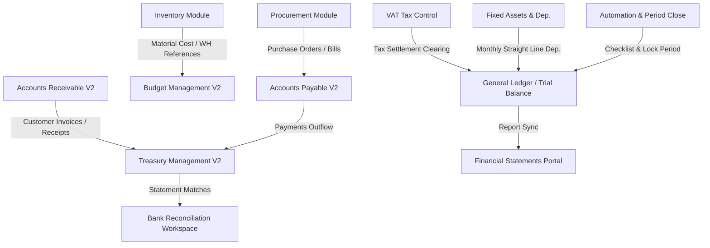

# PetroFlow ERP — Finance V2 Workflow & Integration Documentation

This document describes the design, business logic, integrations, automation rules, and operations of the **Finance V2** module. Designed under a strict **Zero-Impact Architecture**, it extends the PetroFlow ERP without modifying the legacy database schemas, HR, Assets, Procurement, or Inventory modules.

---

## 1. Integration Flow & Architecture Diagram

---

## 2. Cycle-by-Cycle Business Workflows

### 2.1. Accounts Payable (AP) Cycle
1. **Supplier Registration**: Master-Detail directory of suppliers containing tax ID/VAT registers.
2. **Invoice Processing**:
   - Matches Supplier Invoices to Purchase Orders (from Procurement) and Warehouse Receipts (from Inventory).
   - Validation checks: Missing project cost centers, duplicate invoice numbers, negative values.
   - States: `Draft` ➜ `Approved` ➜ `Paid` ➜ `Overdue`.
3. **Payment Execution**:
   - Queues approved invoices for payment vouchers.
   - Updates corresponding Bank Account / Cash Box balances in the Treasury module.

### 2.2. Accounts Receivable (AR) Cycle
1. **Customer Registry**: Tracks petroleum clients, billing terms, and credit limits.
2. **Customer Invoices**:
   - Integrates with Sales Orders to generate sales progress billing.
   - States: `Draft` ➜ `Approved` ➜ `Sent` ➜ `Paid` ➜ `Partial`.
3. **Collections Allocations**:
   - Collects payments through check, bank transfer, or cash deposits.
   - Allocates collection vouchers against multiple open customer invoices.

### 2.3. Treasury Management (Cash & Bank)
1. **Ledger Accounts**: Registers and tracks Safe Boxes (petty cash, headquarters) and Bank Accounts.
2. **Internal Transfers**:
   - Orchestrates moving liquidity: Cash ➜ Cash, Cash ➜ Bank, Bank ➜ Bank.
   - Validation prevents negative balances and closed safe box transactions.
3. **Bank Reconciliation**:
   - Side-by-side matching of uploaded Bank Statements vs. internal general ledger books.
   - Supports **Auto-Match** (matches reference and amount) and manual matching.

### 2.4. Budget Management V2
1. **Project Budget Header**: Maps budgets to projects and fiscal years.
2. **Line Allocations**: Segregates allocations into categories (Materials, Labor, Fuel, Subcontractors, etc.) and cost centers.
3. **Variance Warnings**:
   - Color-coded signals: Green (<80% utilization), Yellow (80%–100%), Red (>100% exceeded).
   - Restricts active project costs if budgets are locked or exceeded.

### 2.5. VAT Tax Management
1. **Calculations**: `VAT Amount = Taxable Amount × VAT %`.
2. **Return Sheets**: Prepares Q1/Q2/Q3/Q4 VAT returns with automatic input (AP) vs output (AR) calculations.
3. **Clearing Settlement**:
   - Generates mock clearing journal entries to reset VAT Input/Output Control accounts and transfer net differences to VAT Payable/Refundable.

### 2.6. Fixed Assets & Depreciation
1. **Acquisition & Capitalization**:
   - Capitalizes purchased machinery, compressors, generators, and rigs.
2. **Monthly Depreciation**:
   - Standard Straight-Line monthly calculations: `(Original Cost - Residual Value) / Useful Life in Months`.
   - Supports single-click monthly runs, reversal runs, and clearing ledger previews.

### 2.7. Period Close & Month-End Checklist
1. **Checks checklist**: Visual checklists including GL balances validation, aging confirmations, VAT settlement postings, and backups.
2. **Period States**: `Open` ➜ `Soft Close` ➜ `Review` ➜ `Ready to Close` ➜ `Closed` ➜ `Locked`.

---

## 3. Automation Rules & Validation Engine

| Rule Name | Description | Trigger Frequency | Action Taken |
|---|---|---|---|
| **Generate Monthly Depreciation** | Calculates straight-line depreciation for active assets | Monthly Run | Debits Depreciation Expense, Credits Acc. Dep. |
| **Calculate VAT Return** | Compiles input and output VAT registers | Quarterly Run | Generates VAT Return summary sheets |
| **GL Balance Audit** | Scans GL double-entry logs for discrepancies | Daily / Pre-close | Flags unbalanced JV references |
| **Budget Sync** | Syncs actual committed project costs | Daily Run | Updates budget remaining indicators |

---

## 4. User Roles & Permissions

- **Accountant**: Can create draft JVs, invoices, payments, and run cash reconciliations.
- **Financial Reviewer**: Authorizes draft vouchers, verifies budget overrides, and approves reconciliations.
- **Financial Director**: Authorizes period closes, posts clearing settlements, and manages system configurations.
- **System Administrator (Admin)**: Can reopen closed accounting periods and modify core metadata mappings.
