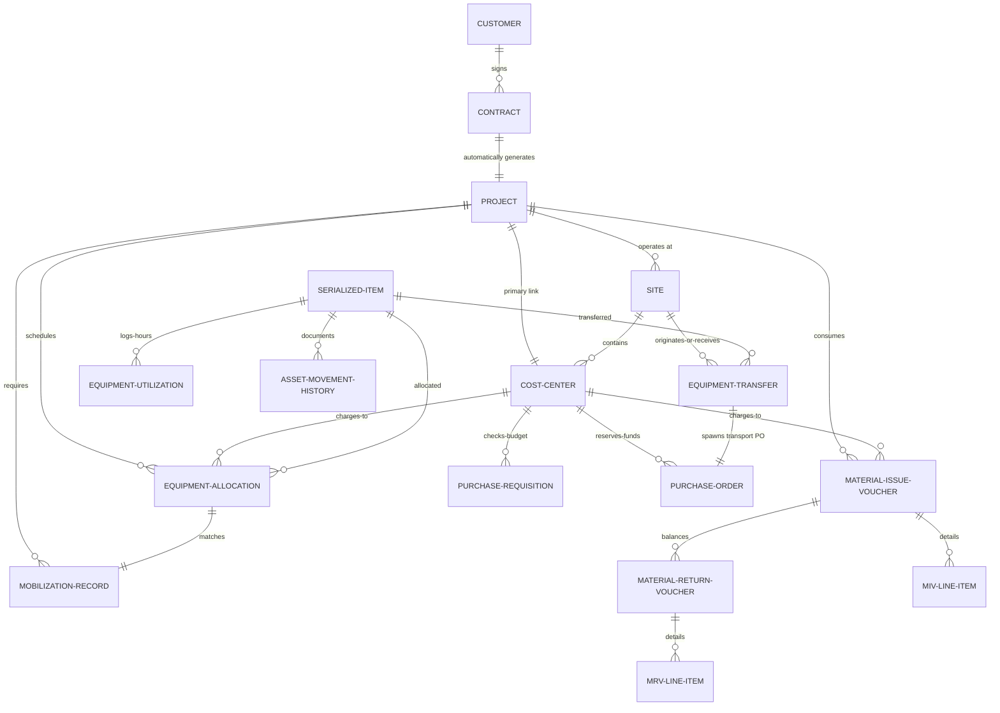
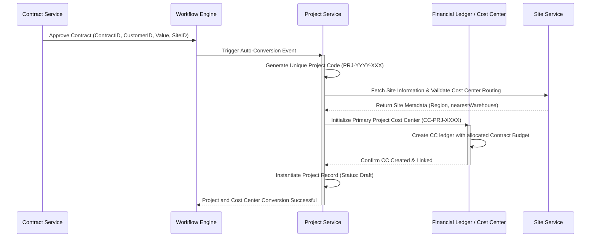
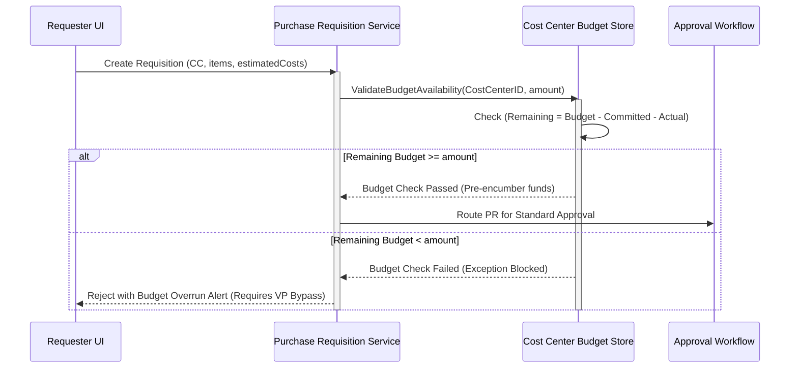
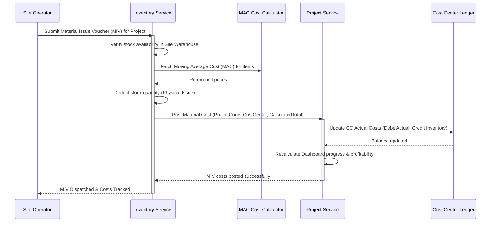

# PetroFlow ERP: Project Management, Cost Centers & Site Operations Blueprint (Phase 2)

This blueprint defines the enterprise-grade architecture for Phase 2 of the PetroFlow ERP system. It extends the Phase 1 Procurement & Receiving blueprint to support project-based Oil & Gas services (such as drilling contracts, rig site services, pipeline construction, and well overhauls). 

---

## 1. Functional Architecture & Conversion Automation

The PetroFlow Project Lifecycle begins automatically upon the financial and legal clearance of a Customer Contract. 

```
[Contract Approved] 
       │
       ▼ (Event Trigger)
[Project Auto-Generated] ──► [Cost Center Activated] ──► [Site Setup Initiated]
```

### 1.1 Contract-to-Project Conversion Rules
1. **Automation Trigger**: When a Contract transitions to `Approved` in the Contract Registry:
   - An event listener intercepts the approval state change.
   - The system invokes the `ProjectGenerationEngine` to construct a new Project record and a default primary Cost Center.
2. **Project Code Generation**: Code generation follows a strict corporate standard:
   - Format: `PRJ-YYYY-[Client-Code]-[Seq]`
   - Example: `PRJ-2026-ARAM-042` (Project generated in 2026 for Saudi Aramco, sequence #42).
3. **Automated Linkages**: The conversion process copies and links:
   - **Customer Reference**: Inherited from the Contract.
   - **Contract Value**: Locked in project financial metadata (base value, currency, and conversion rate).
   - **Contract Duration**: Set as the planned project start/end dates.
   - **Planned Hours**: Extracted from the Contract's resource estimation sheet.
   - **Planned Equipment**: Pre-populated in the project mobilization checklist.
   - **Default Site**: Linked to the geographical operations site specified in the contract.
   - **Primary Cost Center**: Automatically created and linked to track operational expenses.

### 1.2 Project Lifecycle States
- **Draft**: Initial auto-generated state. Scope, mobilization plans, and preliminary budgets are reviewed.
- **Mobilization**: Logistics planning, material ordering, and equipment transfers are active. No revenue is recognized; costs are accumulated as mobilization assets.
- **Active**: Operations are ongoing. Timesheets are posted, equipment is running, and progress billing is active.
- **Suspended**: Operations temporarily halted (e.g., weather, client standby, safety stand-down). Costs are tracked under idle cost accounts.
- **Completed**: On-site operations concluded, all assets demobilized, and hand-over certificate received.
- **Closed**: Financial ledger closed, final invoice cleared, no further costs or timesheets allowed.

---

## 2. Site Operations & Management

In Oil & Gas service delivery, "Sites" represent physical operating nodes (e.g., Rig Sites, Offshore Platforms, Base Camps, Pipelines). Sites determine logistical routing and financial routing.

```
                  ┌─────────────── Site Entity ───────────────┐
                  │                                           │
                  ▼                                           ▼
       [Logistics Routing]                           [Financial Routing]
   ├── Equipment Source Warehouse                 ├── Project Charging Center
   ├── Material Source Warehouse                  └── Regional Tax/Currency Context
   └── Nearest Maintenance Yard
```

### 2.1 Site Rules & Fields
- Every Project must be assigned to exactly one Site.
- **Nearest Warehouses / Yards**: When a Project issues a requisition for raw materials (such as mud, drill pipe grease, or casing) or serialized equipment (such as blowout preventers or valves), the system queries the Site's `nearestWarehouseId` and `nearestEquipmentYardId` to determine the primary inventory source before attempting inter-warehouse transfers.
- **Site Status**: Manageable from `Active`, `Mobilizing`, `Inactive`, and `Decommissioned`.

---

## 3. Cost Center Ledger & Budget Control

The Cost Center is the central ledger mechanism that monitors financial health and guards against budget overruns.

### 3.1 Real-Time Transaction Routing Matrix
All transactional entries in the ERP must carry a `costCenterCode` to enforce real-time reporting and budget controls:

| Transaction Type | Cost Center Interaction | Financial Ledger Effect |
| :--- | :--- | :--- |
| **Purchase Requisition (PR)** | Pre-encumbrance check against Cost Center budget | Committed Budget increased (pending approval) |
| **Purchase Order (PO)** | Hard reservation of funds | Committed Budget confirmed, Available Budget reduced |
| **Inventory Issue (MIV)** | Material cost charged directly to the Project | Inventory asset debited; Project operational cost credited |
| **Inventory Return (MRV)** | Unused material value credited back to the Cost Center | Project cost credited; Inventory asset debited |
| **Equipment Allocation** | Internal rental charge based on active hours | Cost Center charged rental; Equipment Yard credited |
| **Equipment Transfer** | Logistics cost allocated based on travel/fuel | Transfer expense loaded to project mobilization account |
| **Maintenance Costs** | Work order parts & labor charged to site/asset | Asset maintenance cost debited; Cost Center updated |
| **Vendor Invoices** | Verification of 3-way match | Actual Cost debited (relieving committed PO budget) |
| **Project Expenses** | Direct cash/petty cash operational expenditures | Actual Cost debited immediately |

### 3.2 Real-Time Budget Consumption Formulas
For any given Cost Center:
$$\text{Total Budget} = \text{Initial Approved Budget} + \text{Approved Variations}$$
$$\text{Committed Costs} = \sum (\text{Approved POs Outstanding}) + \sum (\text{PRs Under Review})$$
$$\text{Actual Costs} = \sum (\text{GRN Invoiced Receipts}) + \sum (\text{Direct Expenses}) + \sum (\text{Material Issues}) + \sum (\text{Asset Allocation Charges})$$
$$\text{Remaining Budget} = \text{Total Budget} - (\text{Committed Costs} + \text{Actual Costs})$$

> [!WARNING]
> If a Purchase Requisition or Inventory Issue exceeds the `Remaining Budget` of its linked Cost Center, the system will trigger a **Budget Exception Block**, requiring hierarchical VP approval to bypass.

---

## 4. Equipment Logistics (Allocation & Transfers)

Equipment logistics coordinates the mobilization and relocation of high-value, serialized assets across sites, warehouses, and maintenance facilities.

```
                      ┌──────────────────────┐
                      │  Allocation Request  │
                      └──────────┬───────────┘
                                 │
                                 ▼
                      ┌──────────────────────┐
                      │       Approval       │
                      └──────────┬───────────┘
                                 │
                                 ▼
                      ┌──────────────────────┐
                      │     Mobilization     │
                      └──────────┬───────────┘
                                 │
                                 ▼
                      ┌──────────────────────┐
                      │    Active at Site    │
                      └──────────┬───────────┘
                                 │
                                 ▼
                      ┌──────────────────────┐
                      │  Returned to Yard/   │
                      │   Transferred Out    │
                      └──────────────────────┘
```

### 4.1 Equipment Allocation Lifecycle
1. **Requested**: Project Manager files a request specifying required asset class, parameters, mobilization date, and cost center.
2. **Approved**: Logistics coordinator selects a serialized asset from a warehouse, yard, or another project site.
3. **Mobilized**: Asset is dispatched on transport. Transport PO is generated.
4. **Active**: Asset is received at the destination site and logged into operations.
5. **Returned**: Asset is decommissioned from the project, inspected, and returned to base or transferred.

### 4.2 Equipment Transfer Workflow
Unlike allocations (which assign asset responsibility to a project), a **Transfer** is the physical movement document tracking transport logistics. The workflow consists of:
- **Transfer Request**: Initiated by logistics or site managers when an asset is needed at Site B or must return to a Workshop for repairs.
- **Approval**: Authorized by the equipment operations director.
- **Dispatch**: Issued from the source location. Transit starts, logging departure time and initial odometer/hour meters.
- **Arrival & Receiving**: Inspection at destination. Actual arrival time, travel hours, distance, and transport costs are logged. The system updates the asset's current location and cost center associations.

---

## 5. Inventory Movements (MIV & MRV)

Materials and consumables required for operations must be formally tracked during issue and return.

```
            ┌───────────────── Warehouse ─────────────────┐
            │                                             │
            │   (MIV Issued)                      (MRV)   │
            ▼                                             ▲
    Project / Cost Center ────────────────────────────────┘
```

### 5.1 Material Issue Voucher (MIV)
- Tracks movement of items from inventory storage to a Project, Cost Center, or specific Serialized Equipment.
- Logs: `Requested Qty` (from PR/planning) vs `Issued Qty` (actual dispatched).
- Material cost is instantly computed based on the Moving Average Cost (MAC) and loaded into the project's **Actual Cost ledger**.

### 5.2 Material Return Voucher (MRV)
- Used for returning clean, unused, or surplus materials back to the warehouse.
- Tracks: `Returned Qty` and `Condition` (Restockable, Needs Inspection, Scrap).
- The system credits the project's Actual Cost ledger using the original issue unit price and increases inventory stock counts.

---

## 6. Asset Operations (Equipment Utilization)

Maximizing uptime and tracking wear and tear is vital for drilling equipment and rig tooling.

### 6.1 Utilization & Availability Formulas
For every serialized asset:
- **Running Hours**: Hours spent performing active operations.
- **Idle Hours**: Hours asset was available and ready but not utilized.
- **Downtime Hours**: Hours asset was inoperable due to unscheduled breakdowns.
- **Maintenance Hours**: Hours spent on scheduled PM (Preventive Maintenance) or overhaul.

$$\text{Total Period Hours} = \text{Running Hours} + \text{Idle Hours} + \text{Downtime Hours} + \text{Maintenance Hours}$$

$$\text{Availability \%} = \frac{\text{Running Hours} + \text{Idle Hours} + \text{Maintenance Hours}}{\text{Total Period Hours}} \times 100\%$$

$$\text{Operating Utilization \%} = \frac{\text{Running Hours}}{\text{Total Period Hours} - \text{Downtime Hours}} \times 100\%$$

$$\text{Cost Per Hour} = \frac{\text{Period Mobilization Cost} + \text{Direct Maintenance Cost} + \text{Operator Labor Costs}}{\text{Running Hours}}$$

### 6.2 Asset Movement Timeline
Every serialized piece of equipment must maintain a chronological, tamper-proof history:

```
[Purchase] ──► [Inspection] ──► [Warehouse] ──► [Allocation] ──► [Mobilization] 
                                                                       │
[Disposal] ◄── [Return] ◄── [Maintenance] ◄── [Transfer] ◄── [Site Usage] ◄──┘
```

---

## 7. Logistics & Mobilization Orchestration

Mobilization coordinates human resources, heavy machinery, materials, and support vehicles required to execute a site-based project.

### 7.1 Mobilization Record Structure
- **Scope**: Combines Personnel (crew logs, HSE certs), Equipment (serialized assets), Vehicles (trucks, low-boys), and Materials (initial mud packs, water tanks).
- **Logistics Logs**: Departure date/time, carrier name, transport vendor, and transport purchase order (PO).
- **Costs**: Mobilization costs are captured through dedicated vendor invoices (transport logistics POs) and capitalised or expensed directly to the project's mobilization phase cost code.

---

## 8. System Entity Relationship Diagram (ERD)

This diagram establishes the database structure and how the new operational modules link back to Phase 1 Procurement & Receiving entities.



---

## 9. Multi-Module Integration Matrix

### 9.1 Sequence: Contract Approval to Project & Cost Center Creation


### 9.2 Sequence: Requisition Cost Center Budget Check


### 9.3 Sequence: Material Issue & Project Cost Accumulation


---

## 10. Unified TypeScript Interfaces Registry

This section contains the comprehensive, type-safe API data structures modeling Phase 2 operations.

```typescript
// ==========================================
// SHARED COMMON TYPES
// ==========================================
export type ProjectStatus = 'Draft' | 'Mobilization' | 'Active' | 'Suspended' | 'Completed' | 'Closed';
export type SiteStatus = 'Active' | 'Mobilizing' | 'Inactive' | 'Decommissioned';
export type CostCenterStatus = 'Active' | 'Locked' | 'OverBudget';
export type AllocationStatus = 'Requested' | 'Approved' | 'Mobilized' | 'Active' | 'Returned';
export type TransferStatus = 'Requested' | 'Approved' | 'Dispatched' | 'Arrived' | 'Received';
export type MovementAction = 'Purchase' | 'Inspection' | 'WarehouseEntry' | 'Allocation' | 'Mobilization' | 'SiteUsage' | 'Transfer' | 'Maintenance' | 'Return' | 'Disposal';

// ==========================================
// 1. PROJECT ENTITY
// ==========================================
export interface Project {
  projectCode: string;       // PRJ-YYYY-CLIENT-SEQ (Primary Key)
  projectName: string;
  contractId: string;        // Link to Contract Registry
  customerCode: string;      // Link to Customer Master
  siteCode: string;          // Link to operating Site
  costCenterCode: string;    // Primary financial Cost Center
  contractValueUSD: number;
  contractDuration: {
    startDate: string;
    endDate: string;
  };
  plannedHours: number;
  plannedEquipmentCodes: string[];
  status: ProjectStatus;
  revenueGeneratedUSD: number;
  projectManager: string;
  createdDate: string;
  closedDate?: string;
}

// ==========================================
// 2. SITE ENTITY
// ==========================================
export interface Site {
  siteCode: string;          // SIT-XXX
  siteName: string;
  customerCode: string;
  region: string;            // e.g., 'Gulf of Suez', 'Western Desert'
  gpsCoordinates: {
    latitude: number;
    longitude: number;
  };
  siteManager: string;
  costCenterCode: string;    // Site-level CC
  nearestWarehouseId: string;
  nearestEquipmentYardId: string;
  status: SiteStatus;
}

// ==========================================
// 3. COST CENTER ENTITY
// ==========================================
export interface CostCenter {
  costCenterCode: string;    // CC-XXX
  costCenterName: string;
  siteCode?: string;         // Link if dedicated to a specific Site
  projectCode?: string;      // Link if dedicated to a specific Project
  budgetUSD: number;
  actualCostUSD: number;
  committedCostUSD: number;  // Reserved via PRs/POs
  remainingBudgetUSD: number; // Derived: budget - (actual + committed)
  status: CostCenterStatus;
}

// ==========================================
// 4. EQUIPMENT ALLOCATION ENTITY
// ==========================================
export interface EquipmentAllocation {
  allocationId: string;      // ALC-YYYY-XXX
  equipmentCode: string;     // Reference to generic registry
  serialNumber: string;      // Unique Serial Identifier
  sourceLocationType: 'Warehouse' | 'EquipmentYard' | 'ProjectSite';
  sourceLocationId: string;
  destinationProjectCode: string;
  costCenterCode: string;
  mobilizationDate: string;
  expectedReturnDate: string;
  actualReturnDate?: string;
  authorizedBy: string;
  status: AllocationStatus;
}

// ==========================================
// 5. EQUIPMENT TRANSFER ENTITY
// ==========================================
export interface EquipmentTransfer {
  transferId: string;        // TRF-YYYY-XXX
  serialNumber: string;
  sourceLocation: {
    type: 'Site' | 'Warehouse' | 'Workshop' | 'MaintenanceYard';
    id: string;
  };
  destinationLocation: {
    type: 'Site' | 'Warehouse' | 'Workshop' | 'MaintenanceYard';
    id: string;
  };
  dispatchDate?: string;
  arrivalDate?: string;
  travelHours: number;
  distanceKm: number;
  logisticsCostUSD: number;
  transportVendorCode?: string;
  transportPoNumber?: string;
  status: TransferStatus;
  handlingInspector: string;
  transferHistory: {
    stage: TransferStatus;
    timestamp: string;
    actionedBy: string;
    notes?: string;
  }[];
}

// ==========================================
// 6. MATERIAL ISSUE VOUCHER (MIV)
// ==========================================
export interface MIVLineItem {
  itemCode: string;
  quantityRequested: number;
  quantityIssued: number;
  unitPriceUSD: number;      // MAC-based price at issue time
  totalPriceUSD: number;
}

export interface MaterialIssueVoucher {
  mivNumber: string;         // MIV-YYYY-XXX
  warehouseId: string;
  projectCode?: string;
  costCenterCode: string;
  issuedToEquipmentSerial?: string; // If issued specifically to service a machine
  issueDate: string;
  issuedBy: string;
  receivedBy: string;
  items: MIVLineItem[];
  totalVoucherValueUSD: number;
  isPostedToLedger: boolean;
}

// ==========================================
// 7. MATERIAL RETURN VOUCHER (MRV)
// ==========================================
export interface MRVLineItem {
  itemCode: string;
  quantityReturned: number;
  originalUnitPriceUSD: number;
  condition: 'Restockable' | 'InspectionRequired' | 'Scrap';
}

export interface MaterialReturnVoucher {
  mrvNumber: string;         // MRV-YYYY-XXX
  mivNumber: string;         // Link back to original Issue Voucher
  warehouseId: string;
  returnDate: string;
  returnedBy: string;
  inspectedBy: string;
  items: MRVLineItem[];
  totalReturnedValueUSD: number;
  isPostedToLedger: boolean;
}

// ==========================================
// 8. EQUIPMENT UTILIZATION RECORD
// ==========================================
export interface EquipmentUtilization {
  recordId: string;          // UTL-YYYY-MM-DD-SERIAL
  serialNumber: string;
  projectCode: string;
  logDate: string;
  runningHours: number;
  idleHours: number;
  downtimeHours: number;
  maintenanceHours: number;
  operatorNotes?: string;
  fuelConsumedLiters?: number;
  metrics: {
    availabilityPercent: number;  // Calculated
    utilizationPercent: number;   // Calculated
    costPerHourUSD: number;       // Calculated
  };
}

// ==========================================
// 9. MOBILIZATION RECORD
// ==========================================
export interface MobResourceItem {
  type: 'Equipment' | 'Vehicle' | 'Personnel' | 'Material';
  referenceId: string;        // SerialNumber, EmployeeID, or ItemCode
  displayName: string;
  hseCertified: boolean;
  status: 'Pending' | 'Mobilized' | 'Demobilized';
}

export interface MobilizationRecord {
  mobId: string;             // MOB-YYYY-XXX
  projectCode: string;
  type: 'Mobilization' | 'Demobilization';
  plannedStartDate: string;
  actualDepartureDate?: string;
  actualArrivalDate?: string;
  resources: MobResourceItem[];
  transportVendorCode: string;
  transportPoNumber: string;
  actualLogisticsCostUSD: number;
  status: 'Planning' | 'InTransit' | 'Completed' | 'Delayed';
}

// ==========================================
// 10. ASSET MOVEMENT TIMELINE
// ==========================================
export interface AssetMovementHistory {
  historyId: string;
  serialNumber: string;
  action: MovementAction;
  timestamp: string;
  fromLocation: string;
  toLocation: string;
  projectCode?: string;
  costCenterCode?: string;
  referenceDocType: 'PO' | 'Inspection' | 'MIV' | 'MRV' | 'Allocation' | 'Transfer' | 'WorkOrder';
  referenceDocNumber: string; // The specific ID of the doc triggering movement
  performedBy: string;
  comments?: string;
}
```

---

## 11. Angular 19 Standalone & Signals Implementation Blueprint

Following PetroFlow's enterprise guidelines, all new views are standalone components driven by centralized stores using Angular 19 Signals.

```
src/app/features/
├── projects/
│   ├── components/
│   │   ├── project-list/
│   │   ├── project-detail/
│   │   ├── project-dashboard/
│   │   └── contract-conversion/
│   ├── services/
│   │   └── project.service.ts
│   └── store/
│       └── project.store.ts
├── logistics-operations/
│   ├── components/
│   │   ├── site-registry/
│   │   ├── equipment-allocator/
│   │   ├── asset-transfer-manager/
│   │   └── mob-demob-dashboard/
│   ├── services/
│   │   └── logistics.service.ts
│   └── store/
│       └── logistics.store.ts
├── cost-centers/
│   ├── components/
│   │   ├── cost-center-ledger/
│   │   └── budget-allocator/
│   ├── services/
│   │   └── finance.service.ts
│   └── store/
│       └── finance.store.ts
└── materials-issue/
    ├── components/
    │   ├── miv-registry/
    │   ├── mrv-registry/
    │   └── issue-voucher-form/
    ├── services/
    │   └── materials-movement.service.ts
    └── store/
        └── materials.store.ts
```

### 11.1 Route Mapping (`app.routes.ts`)
```typescript
import { Routes } from '@angular/router';

export const routes: Routes = [
  {
    path: 'projects',
    children: [
      {
        path: '',
        loadComponent: () => import('./features/projects/components/project-list/project-list.component').then(m => m.ProjectListComponent)
      },
      {
        path: 'dashboard/:projectCode',
        loadComponent: () => import('./features/projects/components/project-dashboard/project-dashboard.component').then(m => m.ProjectDashboardComponent)
      },
      {
        path: 'detail/:projectCode',
        loadComponent: () => import('./features/projects/components/project-detail/project-detail.component').then(m => m.ProjectDetailComponent)
      }
    ]
  },
  {
    path: 'logistics',
    children: [
      {
        path: 'sites',
        loadComponent: () => import('./features/logistics-operations/components/site-registry/site-registry.component').then(m => m.SiteRegistryComponent)
      },
      {
        path: 'allocations',
        loadComponent: () => import('./features/logistics-operations/components/equipment-allocator/equipment-allocator.component').then(m => m.EquipmentAllocatorComponent)
      },
      {
        path: 'transfers',
        loadComponent: () => import('./features/logistics-operations/components/asset-transfer-manager/asset-transfer-manager.component').then(m => m.AssetTransferManagerComponent)
      },
      {
        path: 'mob-demob',
        loadComponent: () => import('./features/logistics-operations/components/mob-demob-dashboard/mob-demob-dashboard.component').then(m => m.MobDemobDashboardComponent)
      }
    ]
  },
  {
    path: 'cost-centers',
    loadComponent: () => import('./features/cost-centers/components/cost-center-ledger/cost-center-ledger.component').then(m => m.CostCenterLedgerComponent)
  },
  {
    path: 'materials',
    children: [
      {
        path: 'issue',
        loadComponent: () => import('./features/materials-issue/components/miv-registry/miv-registry.component').then(m => m.MivRegistryComponent)
      },
      {
        path: 'return',
        loadComponent: () => import('./features/materials-issue/components/mrv-registry/mrv-registry.component').then(m => m.MrvRegistryComponent)
      }
    ]
  }
];
```

### 11.2 Centralized Angular Signal Store (`project.store.ts`)
The `ProjectStore` utilizes stateful signals and computed properties to serve dashboard widgets and forms reactively.

```typescript
import { Injectable, signal, computed, inject } from '@angular/core';
import { Project, Site, CostCenter, EquipmentAllocation, EquipmentUtilization, MaterialIssueVoucher } from './project-interfaces';
import { ProjectService } from '../services/project.service';

@Injectable({
  providedIn: 'root'
})
export class ProjectStore {
  private projectService = inject(ProjectService);

  // ==========================================
  // STATE SIGNALS
  // ==========================================
  readonly projects = signal<Project[]>([]);
  readonly sites = signal<Site[]>([]);
  readonly costCenters = signal<CostCenter[]>([]);
  
  readonly selectedProjectCode = signal<string | null>(null);
  
  // Logistics and Movements tracking caches
  readonly allocations = signal<EquipmentAllocation[]>([]);
  readonly utilizations = signal<EquipmentUtilization[]>([]);
  readonly mivs = signal<MaterialIssueVoucher[]>([]);

  // ==========================================
  // COMPUTED SELECTORS
  // ==========================================
  readonly activeProject = computed(() => {
    const code = this.selectedProjectCode();
    return this.projects().find(p => p.projectCode === code) || null;
  });

  readonly activeProjectCostCenter = computed(() => {
    const project = this.activeProject();
    if (!project) return null;
    return this.costCenters().find(cc => cc.costCenterCode === project.costCenterCode) || null;
  });

  // Comprehensive Real-time Dashboard calculations
  readonly projectDashboardMetrics = computed(() => {
    const project = this.activeProject();
    const costCenter = this.activeProjectCostCenter();
    if (!project || !costCenter) return null;

    // Filter relevant logs for the active project
    const projectMivs = this.mivs().filter(miv => miv.projectCode === project.projectCode);
    const projectAllocations = this.allocations().filter(alc => alc.destinationProjectCode === project.projectCode);
    const projectUtilizations = this.utilizations().filter(utl => utl.projectCode === project.projectCode);

    // Sum running hours and total planned costs
    const consumedHours = projectUtilizations.reduce((acc, curr) => acc + curr.runningHours, 0);
    const downtimeHours = projectUtilizations.reduce((acc, curr) => acc + curr.downtimeHours, 0);
    const maintenanceHours = projectUtilizations.reduce((acc, curr) => acc + curr.maintenanceHours, 0);
    const totalIdleHours = projectUtilizations.reduce((acc, curr) => acc + curr.idleHours, 0);

    const warehouseIssuesValue = projectMivs.reduce((acc, curr) => acc + curr.totalVoucherValueUSD, 0);
    const activeEquipmentCount = projectAllocations.filter(alc => alc.status === 'Active').length;

    // Profitability
    const revenue = project.revenueGeneratedUSD;
    const actualCost = costCenter.actualCostUSD;
    const remainingBudget = costCenter.remainingBudgetUSD;
    const contractValue = project.contractValueUSD;
    const profitabilityUSD = revenue - actualCost;
    const profitabilityPercent = revenue > 0 ? (profitabilityUSD / revenue) * 100 : 0;

    // Progress estimation based on hours and budget spent
    const elapsedHoursRatio = project.plannedHours > 0 ? (consumedHours / project.plannedHours) : 0;
    const budgetBurnRatio = contractValue > 0 ? (actualCost / contractValue) : 0;
    // Composite Progress Indicator
    const progressPercent = Math.min(100, Math.round(((elapsedHoursRatio + budgetBurnRatio) / 2) * 100));

    return {
      contractValue,
      actualCost,
      remainingBudget,
      plannedHours: project.plannedHours,
      consumedHours,
      remainingHours: Math.max(0, project.plannedHours - consumedHours),
      downtimeHours,
      maintenanceHours,
      totalIdleHours,
      activeEquipmentCount,
      warehouseIssuesValue,
      progressPercent,
      revenue,
      profitabilityUSD,
      profitabilityPercent
    };
  });

  // Filtered lists for site managers
  readonly activeAllocationsForSite = computed(() => {
    return this.allocations().filter(alloc => alloc.status === 'Active');
  });

  // ==========================================
  // STATE MUTATING OPERATIONS (Actions)
  // ==========================================
  async loadProjects() {
    try {
      const data = await this.projectService.fetchProjects();
      this.projects.set(data);
    } catch (error) {
      console.error('Failed loading projects', error);
    }
  }

  async loadFinancialData() {
    try {
      const [ccData, mivData] = await Promise.all([
        this.projectService.fetchCostCenters(),
        this.projectService.fetchMIVs()
      ]);
      this.costCenters.set(ccData);
      this.mivs.set(mivData);
    } catch (error) {
      console.error('Failed financial synchronization', error);
    }
  }

  selectProject(projectCode: string) {
    this.selectedProjectCode.set(projectCode);
  }

  addProjectLocally(newProject: Project) {
    this.projects.update(prev => [...prev, newProject]);
  }

  updateCostCenterCosts(ccCode: string, amount: number, isDirectCost: boolean) {
    this.costCenters.update(list => 
      list.map(cc => {
        if (cc.costCenterCode === ccCode) {
          const updatedActual = isDirectCost ? cc.actualCostUSD + amount : cc.actualCostUSD;
          const updatedCommitted = !isDirectCost ? cc.committedCostUSD + amount : cc.committedCostUSD;
          return {
            ...cc,
            actualCostUSD: updatedActual,
            committedCostUSD: updatedCommitted,
            remainingBudgetUSD: cc.budgetUSD - (updatedActual + updatedCommitted)
          };
        }
        return cc;
      })
    );
  }
}
```

### 11.3 Services Blueprint Example (`project.service.ts`)
This client service handles asynchronous network calls and transforms incoming raw payloads into the type-safe contract interfaces before updating the Signal stores.

```typescript
import { Injectable, inject } from '@angular/core';
import { HttpClient } from '@angular/common/http';
import { firstValueFrom } from 'rxjs';
import { Project, CostCenter, MaterialIssueVoucher } from './project-interfaces';

@Injectable({
  providedIn: 'root'
})
export class ProjectService {
  private http = inject(HttpClient);
  private apiUrl = '/api/v1/projects-operations';

  async fetchProjects(): Promise<Project[]> {
    return firstValueFrom(this.http.get<Project[]>(`${this.apiUrl}/projects`));
  }

  async fetchCostCenters(): Promise<CostCenter[]> {
    return firstValueFrom(this.http.get<CostCenter[]>(`${this.apiUrl}/cost-centers`));
  }

  async fetchMIVs(): Promise<MaterialIssueVoucher[]> {
    return firstValueFrom(this.http.get<MaterialIssueVoucher[]>(`${this.apiUrl}/material-issues`));
  }

  async triggerContractConversion(contractId: string, initialSiteCode: string): Promise<Project> {
    return firstValueFrom(
      this.http.post<Project>(`${this.apiUrl}/contracts/convert`, { contractId, initialSiteCode })
    );
  }
}
```

### 11.4 Dashboard Widgets UI Blueprint
The project dashboard is built as an Angular standalone landing zone containing four distinct widgets fed directly from the `projectDashboardMetrics` selector:

1. **Financial Performance Card (Widget 1)**:
   - Displays Contract Value, Actual Cost (MTD & YTD), and Remaining Budget.
   - Includes a radial budget warning indicator (progress ring highlighting red if remaining budget drops below 10%).
   - Displays Revenue vs Cost delta to show Net Margin/Profitability.
2. **Resource & Manpower Hours (Widget 2)**:
   - Tracks Planned Hours vs Consumed Hours.
   - Shows a stacked timeline bar of Running, Idle, and Maintenance/Downtime hours.
3. **Logistics & Equipment Radar (Widget 3)**:
   - Lists active allocated serialized equipment with rapid shortcuts to open transit transfer documents.
   - Details Total Warehouse Issue (MIV) voucher expenditures.
4. **Operations Progress Dashboard (Widget 4)**:
   - Displays Composite Progress % (derived from budget spent and hours logged).
   - Generates quick alerts for overdue equipment, pending asset maintenance, or depleted inventory levels on site.
