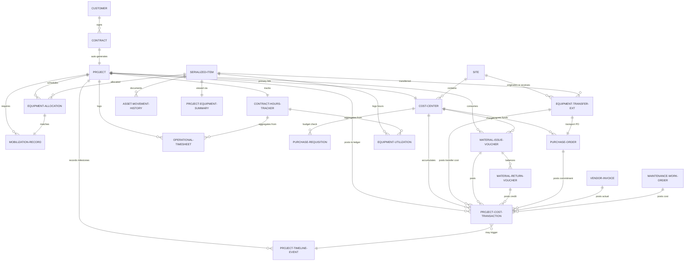

# PetroFlow ERP — Phase 2 Extension: Project 360 Dashboard & Cost Control
## Part 1 of 2 — Entities, Interfaces & Data Architecture

> **Extends**: `petroflow_erp_phase2_blueprint.md` (Phase 2 baseline).
> All existing sections remain intact. This document adds Sections 12–17.

---

## 12. Project Cost Transaction Ledger

Every financial event across Procurement, Inventory, Equipment, Logistics, Maintenance, and Finance must post a single normalized row to the **Project Cost Transaction Ledger** (`PCTL`). This creates one auditable source of truth for project profitability.

### 12.1 Ledger Posting Rules

| Source Module | Transaction Type | Dr / Cr | Ledger Effect |
|:---|:---|:---|:---|
| Purchase Order (approved) | `PO_COMMITMENT` | Debit Committed | Raises committed cost; reduces available budget |
| Vendor Invoice (3-way matched) | `VENDOR_INVOICE` | Debit Actual / Credit Committed | Converts committed → actual; releases PO reserve |
| Material Issue Voucher | `MIV_ISSUE` | Debit Actual | Direct actual cost at MAC rate |
| Material Return Voucher | `MRV_RETURN` | Credit Actual | Reverses MIV cost; restocks inventory |
| Equipment Allocation charge | `EQUIP_ALLOCATION` | Debit Actual | Internal rental rate × active days |
| Equipment Transfer logistics | `EQUIP_TRANSFER` | Debit Actual | Transport PO cost charged to receiving project |
| Maintenance Work Order | `MAINTENANCE_WO` | Debit Actual | Parts + labor posted against equipment serial |
| Direct Project Expense | `DIRECT_EXPENSE` | Debit Actual | Cash/petty-cash operational spend |

### 12.2 Budget Availability Guard

```
BEFORE any transaction posts to PCTL:
  1. Fetch CostCenter.remainingBudgetUSD
  2. If transaction.amountUSD > remainingBudgetUSD:
       → Block posting
       → Raise BudgetExceptionAlert (severity = CRITICAL)
       → Route to VP for override approval
  3. Else:
       → Post ledger row
       → Recalculate CostCenter totals (reactive signal update)
       → Push delta to Project360Dashboard computed selector
```

---

## 13. Contract Hours Tracking

Hours are the primary operational currency in Oil & Gas service contracts (rig-day contracts, BOP service hour contracts, etc.).

### 13.1 Hours Computation Chain

```
[Equipment Utilization Log] ──► running_hours accumulate per project
[Operational Timesheet]     ──► personnel hours accumulate per project
        │
        ▼
[HoursTracker (computed)]
  contractedHours      = Project.plannedHours  (from contract)
  consumedHours        = Σ EquipmentUtilization.runningHours  +  Σ Timesheet.hours
  remainingHours       = contractedHours − consumedHours
  utilizationPercent   = (consumedHours / contractedHours) × 100
```

> [!WARNING]
> When `utilizationPercent ≥ 90%`, the system raises a **Hours Depletion Alert** routed to the Project Manager and Contract Manager for scope review or contract extension initiation.

---

## 14. Project Timeline Entity

A project-scoped chronological event log capturing every milestone and operational event automatically.

### 14.1 Timeline Event Sources

| Event Type | Trigger Source | Auto or Manual |
|:---|:---|:---|
| `CONTRACT_APPROVED` | Contract workflow state change | Auto |
| `PROJECT_CREATED` | ContractConversionEngine | Auto |
| `COST_CENTER_CREATED` | ProjectGenerationEngine | Auto |
| `MOBILIZATION_STARTED` | MobilizationRecord status → InTransit | Auto |
| `MOBILIZATION_COMPLETED` | MobilizationRecord status → Completed | Auto |
| `EQUIPMENT_ALLOCATED` | EquipmentAllocation status → Mobilized | Auto |
| `EQUIPMENT_TRANSFERRED` | EquipmentTransfer status → Received | Auto |
| `MATERIAL_ISSUED` | MaterialIssueVoucher posted | Auto |
| `PURCHASE_ORDER_RAISED` | PO status → Approved | Auto |
| `GOODS_RECEIPT_POSTED` | GRN confirmed | Auto |
| `MAINTENANCE_ACTIVITY` | WorkOrder closed | Auto |
| `PROJECT_SUSPENDED` | Project status → Suspended | Auto |
| `PROJECT_COMPLETED` | Project status → Completed | Auto |
| `MANUAL_NOTE` | Project Manager entry | Manual |

---

## 15. Extended TypeScript Interfaces

The following interfaces extend Section 10 of the base blueprint. All existing interfaces remain unchanged.

```typescript
// =====================================================
// EXTENDED COMMON TYPES (appended to existing types)
// =====================================================
export type LedgerTransactionType =
  | 'PO_COMMITMENT'
  | 'VENDOR_INVOICE'
  | 'MIV_ISSUE'
  | 'MRV_RETURN'
  | 'EQUIP_ALLOCATION'
  | 'EQUIP_TRANSFER'
  | 'MAINTENANCE_WO'
  | 'DIRECT_EXPENSE';

export type TimelineEventType =
  | 'CONTRACT_APPROVED'
  | 'PROJECT_CREATED'
  | 'COST_CENTER_CREATED'
  | 'MOBILIZATION_STARTED'
  | 'MOBILIZATION_COMPLETED'
  | 'EQUIPMENT_ALLOCATED'
  | 'EQUIPMENT_TRANSFERRED'
  | 'MATERIAL_ISSUED'
  | 'PURCHASE_ORDER_RAISED'
  | 'GOODS_RECEIPT_POSTED'
  | 'MAINTENANCE_ACTIVITY'
  | 'PROJECT_SUSPENDED'
  | 'PROJECT_COMPLETED'
  | 'MANUAL_NOTE';

export type MaintenanceStatus = 'Operational' | 'ScheduledPM' | 'UnderRepair' | 'Decommissioned';

// =====================================================
// 11. PROJECT COST TRANSACTION LEDGER (PCTL)
// =====================================================
export interface ProjectCostTransaction {
  transactionId: string;       // PCTL-YYYY-XXXXXXX
  transactionType: LedgerTransactionType;
  sourceDocType: 'PO' | 'Invoice' | 'MIV' | 'MRV' | 'Allocation' | 'Transfer' | 'WorkOrder' | 'Expense';
  sourceDocNumber: string;
  projectCode: string;
  siteCode: string;
  costCenterCode: string;
  amountUSD: number;
  isCredit: boolean;            // false = Debit (cost), true = Credit (reversal/return)
  transactionDate: string;
  isPosted: boolean;
  postedBy: string;
  postedAt?: string;
  description: string;
  budgetImpact: 'Actual' | 'Committed' | 'None';
}

// =====================================================
// 12. PROJECT 360 DASHBOARD SNAPSHOT
// (Computed; not persisted — derived from signals)
// =====================================================
export interface Project360Snapshot {
  // Identity
  projectCode: string;
  projectName: string;
  projectStatus: ProjectStatus;

  // Contract & Customer
  contractId: string;
  contractValueUSD: number;
  customerCode: string;
  customerName: string;

  // Site
  siteCode: string;
  siteName: string;
  region: string;

  // Cost Center
  costCenterCode: string;
  budgetUSD: number;
  actualCostUSD: number;
  committedCostUSD: number;
  remainingBudgetUSD: number;
  budgetUtilizationPercent: number;

  // Hours
  contractedHours: number;
  consumedHours: number;
  remainingHours: number;
  hoursUtilizationPercent: number;

  // Equipment
  activeEquipmentCount: number;
  pendingTransfersCount: number;

  // Materials
  totalMIVValueUSD: number;
  totalMRVCreditUSD: number;
  netMaterialCostUSD: number;

  // Procurement
  openPRsCount: number;
  openPOsCount: number;
  pendingGRNsCount: number;
  pendingInvoicesCount: number;

  // Financial
  revenueUSD: number;
  profitabilityUSD: number;
  profitabilityPercent: number;

  // Progress
  progressPercent: number;        // Composite: hours burn + budget burn
  plannedStartDate: string;
  plannedEndDate: string;
  daysElapsed: number;
  daysRemaining: number;
}

// =====================================================
// 13. CONTRACT HOURS TRACKER
// =====================================================
export interface ContractHoursTracker {
  projectCode: string;
  contractedHours: number;
  consumedEquipmentHours: number;
  consumedPersonnelHours: number;
  consumedHoursTotal: number;
  remainingHours: number;
  utilizationPercent: number;
  lastUpdated: string;
  hoursBreakdown: {
    runningHours: number;
    idleHours: number;
    downtimeHours: number;
    maintenanceHours: number;
  };
}

// =====================================================
// 14. PROJECT TIMELINE EVENT
// =====================================================
export interface ProjectTimelineEvent {
  eventId: string;              // EVT-YYYY-XXXXXXX
  projectCode: string;
  eventType: TimelineEventType;
  eventDate: string;
  title: string;
  description: string;
  referenceDocType?: string;
  referenceDocNumber?: string;
  isAutoGenerated: boolean;
  recordedBy: string;
}

// =====================================================
// 15. EXTENDED EQUIPMENT TRANSFER
// (Replaces/extends interface #5 in base blueprint)
// =====================================================
export interface EquipmentTransferExtended {
  transferId: string;           // TRF-YYYY-XXX
  serialNumber: string;
  equipmentName: string;
  sourceLocation: {
    type: 'Site' | 'Warehouse' | 'Workshop' | 'MaintenanceYard';
    id: string;
    name: string;
  };
  destinationLocation: {
    type: 'Site' | 'Warehouse' | 'Workshop' | 'MaintenanceYard';
    id: string;
    name: string;
  };
  chargedProjectCode: string;   // Project bearing the logistics cost
  chargedCostCenterCode: string;
  dispatchDate?: string;
  arrivalDate?: string;
  travelHours: number;
  distanceKm: number;
  logisticsCostUSD: number;
  logisticsVendorCode: string;
  transportPoNumber: string;    // Mandatory: logistics cost must tie to a PO
  status: TransferStatus;
  handlingInspector: string;
  transferHistory: {
    stage: TransferStatus;
    timestamp: string;
    actionedBy: string;
    notes?: string;
  }[];
}

// =====================================================
// 16. PROJECT EQUIPMENT MANAGEMENT VIEW
// =====================================================
export interface ProjectEquipmentSummary {
  projectCode: string;
  serialNumber: string;
  equipmentCode: string;
  equipmentName: string;
  currentLocation: string;
  allocationStatus: AllocationStatus;
  assetStatus: 'Operational' | 'Idle' | 'UnderMaintenance' | 'Transferred';
  maintenanceStatus: MaintenanceStatus;
  totalRunningHours: number;
  totalIdleHours: number;
  totalDowntimeHours: number;
  allocationDate: string;
  expectedReturnDate: string;
  lastInspectionDate?: string;
  costPerHourUSD: number;
  totalChargedCostUSD: number;
}

// =====================================================
// 17. PROJECT PROCUREMENT SUMMARY VIEW
// =====================================================
export interface ProjectProcurementSummary {
  projectCode: string;
  purchaseRequisitions: {
    prNumber: string;
    status: string;
    totalEstimatedUSD: number;
    requestDate: string;
  }[];
  rfqs: {
    rfqNumber: string;
    status: string;
    suppliersInvited: number;
    closingDate: string;
  }[];
  purchaseOrders: {
    poNumber: string;
    supplierName: string;
    totalUSD: number;
    status: string;
    deliveryDate: string;
  }[];
  goodsReceiptNotes: {
    grnNumber: string;
    poNumber: string;
    receivedDate: string;
    totalReceivedUSD: number;
  }[];
  supplierInvoices: {
    invoiceNumber: string;
    supplierName: string;
    invoiceAmountUSD: number;
    status: 'Pending' | 'Matched' | 'Paid' | 'Disputed';
    dueDate: string;
  }[];
  totals: {
    committedPOsUSD: number;
    invoicedUSD: number;
    paidUSD: number;
    pendingPaymentUSD: number;
  };
}

// =====================================================
// 18. PROJECT MATERIALS CONSUMPTION VIEW
// =====================================================
export interface ProjectMaterialsConsumption {
  projectCode: string;
  issues: {
    mivNumber: string;
    issueDate: string;
    itemCount: number;
    totalValueUSD: number;
  }[];
  returns: {
    mrvNumber: string;
    returnDate: string;
    itemCount: number;
    creditValueUSD: number;
  }[];
  itemSummary: {
    itemCode: string;
    itemName: string;
    totalIssuedQty: number;
    totalReturnedQty: number;
    consumedQty: number;
    unitCostUSD: number;
    totalConsumedCostUSD: number;
  }[];
  totals: {
    totalIssuedUSD: number;
    totalReturnedUSD: number;
    netConsumedUSD: number;
  };
}

// =====================================================
// 19. OPERATIONAL TIMESHEET
// =====================================================
export interface OperationalTimesheet {
  timesheetId: string;          // TS-YYYY-XXXXXXX
  projectCode: string;
  siteCode: string;
  costCenterCode: string;
  employeeId: string;
  employeeName: string;
  role: string;
  logDate: string;
  hoursWorked: number;
  activityCode: string;
  activityDescription: string;
  isApproved: boolean;
  approvedBy?: string;
  approvedAt?: string;
}
```

---

## 16. Extended ERD — Full Phase 2 with New Entities


