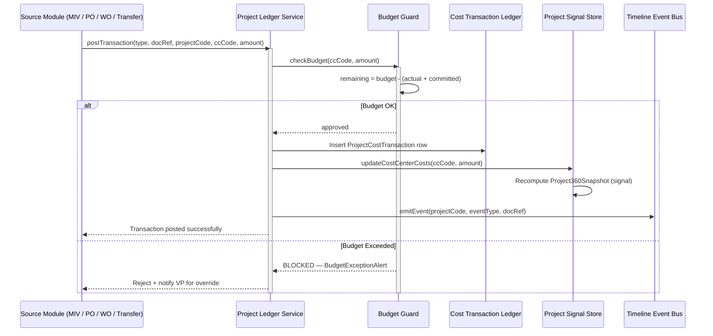
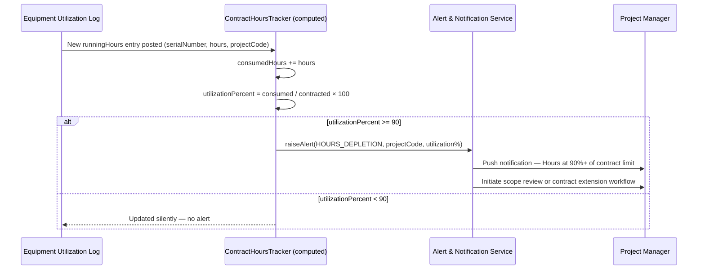

# PetroFlow ERP — Phase 2 Extension: Project 360 Dashboard & Cost Control
## Part 2 of 2 — Integration Flows, Signal Store & Angular Architecture

> **Continues from**: `petroflow_phase2_extension_part1.md`

---

## 17. Integration Sequence Diagrams

### 17.1 PCTL Posting — Full Transaction Flow


### 17.2 Equipment Transfer Cost Charging Flow
```mermaid
sequenceDiagram
    participant LogisticsMgr as Logistics Manager
    participant TransferSvc as Equipment Transfer Service
    participant POService as Purchase Order Service
    participant LedgerSvc as Project Ledger Service
    participant AssetHistory as Asset Movement History

    LogisticsMgr->>TransferSvc: Create Transfer (serial, source, dest, chargedProject, vendor)
    TransferSvc->>POService: Generate Transport PO (vendor, logisticsCost, projectCode)
    POService-->>TransferSvc: transportPoNumber confirmed
    TransferSvc->>TransferSvc: Status → Dispatched

    Note over TransferSvc: On Arrival & Inspection
    TransferSvc->>TransferSvc: Status → Received; log travelHours, distanceKm, actualCost
    TransferSvc->>LedgerSvc: postTransaction(EQUIP_TRANSFER, transferId, chargedProject, ccCode, cost)
    LedgerSvc-->>TransferSvc: Posted to PCTL
    TransferSvc->>AssetHistory: Append movement record (Transfer → Received at destination)
    AssetHistory-->>TransferSvc: Timeline updated
```

### 17.3 Hours Depletion Auto-Alert


---

## 18. Angular 19 — Extended Folder Structure

This extends Section 11 of the base blueprint. All existing feature folders are preserved.

```
src/app/features/
├── projects/
│   ├── components/
│   │   ├── project-list/
│   │   ├── project-detail/
│   │   ├── project-360-dashboard/        ← NEW: unified 360 view
│   │   │   ├── widgets/
│   │   │   │   ├── financial-card/       ← Widget 1: budget & profitability
│   │   │   │   ├── hours-tracker/        ← Widget 2: contracted vs consumed hours
│   │   │   │   ├── equipment-radar/      ← Widget 3: active assets & transfers
│   │   │   │   ├── materials-summary/    ← Widget 4: MIV/MRV consumption
│   │   │   │   ├── procurement-panel/    ← Widget 5: PR/PO/GRN/Invoice summary
│   │   │   │   ├── progress-ring/        ← Widget 6: composite progress %
│   │   │   │   └── timeline-feed/        ← Widget 7: project timeline events
│   │   │   └── project-360-dashboard.component.ts
│   │   ├── cost-transaction-ledger/      ← NEW: PCTL grid view
│   │   ├── project-timeline/             ← NEW: milestone timeline view
│   │   └── contract-conversion/
│   ├── services/
│   │   ├── project.service.ts
│   │   ├── project-ledger.service.ts     ← NEW: PCTL posting & query
│   │   ├── hours-tracker.service.ts      ← NEW: hours aggregation & alerts
│   │   └── timeline.service.ts           ← NEW: event bus & timeline writes
│   └── store/
│       ├── project.store.ts              ← Extended (see §19)
│       └── project-360.store.ts          ← NEW: 360 snapshot computed store
├── logistics-operations/
│   ├── components/
│   │   ├── site-registry/
│   │   ├── equipment-allocator/
│   │   ├── equipment-management/         ← NEW: project equipment mgmt views
│   │   │   ├── active-equipment-list/
│   │   │   ├── equipment-history/
│   │   │   └── equipment-status-card/
│   │   ├── asset-transfer-manager/       ← Extended with cost & vendor fields
│   │   └── mob-demob-dashboard/
│   ├── services/
│   │   └── logistics.service.ts
│   └── store/
│       └── logistics.store.ts
├── cost-centers/
│   ├── components/
│   │   ├── cost-center-ledger/
│   │   └── budget-allocator/
│   ├── services/
│   │   └── finance.service.ts
│   └── store/
│       └── finance.store.ts
└── materials-issue/
    ├── components/
    │   ├── miv-registry/
    │   ├── mrv-registry/
    │   ├── materials-consumption-view/   ← NEW: per-project consumption report
    │   └── issue-voucher-form/
    ├── services/
    │   └── materials-movement.service.ts
    └── store/
        └── materials.store.ts
```

---

## 19. Extended Signal Store — `project-360.store.ts`

```typescript
import { Injectable, signal, computed, inject } from '@angular/core';
import {
  Project, Site, CostCenter,
  EquipmentAllocation, EquipmentUtilization,
  MaterialIssueVoucher, MaterialReturnVoucher,
  ProjectCostTransaction, ProjectTimelineEvent,
  ContractHoursTracker, ProjectEquipmentSummary,
  Project360Snapshot, OperationalTimesheet
} from '../interfaces/project-interfaces';
import { ProjectLedgerService } from '../services/project-ledger.service';

@Injectable({ providedIn: 'root' })
export class Project360Store {
  private ledgerService = inject(ProjectLedgerService);

  // ── Core State Signals ────────────────────────────────────────
  readonly projects          = signal<Project[]>([]);
  readonly sites             = signal<Site[]>([]);
  readonly costCenters       = signal<CostCenter[]>([]);
  readonly selectedCode      = signal<string | null>(null);

  // ── Operational Signals ───────────────────────────────────────
  readonly allocations       = signal<EquipmentAllocation[]>([]);
  readonly utilizations      = signal<EquipmentUtilization[]>([]);
  readonly timesheets        = signal<OperationalTimesheet[]>([]);
  readonly mivs              = signal<MaterialIssueVoucher[]>([]);
  readonly mrvs              = signal<MaterialReturnVoucher[]>([]);
  readonly ledgerEntries     = signal<ProjectCostTransaction[]>([]);
  readonly timelineEvents    = signal<ProjectTimelineEvent[]>([]);

  // ── Procurement Signals (filtered by project) ─────────────────
  readonly projectPOs        = signal<any[]>([]);   // PurchaseOrder[]
  readonly projectPRs        = signal<any[]>([]);   // PurchaseRequisition[]
  readonly projectGRNs       = signal<any[]>([]);   // InspectionRecord[]
  readonly projectInvoices   = signal<any[]>([]);   // VendorInvoice[]

  // ══ COMPUTED SELECTORS ════════════════════════════════════════

  readonly activeProject = computed(() =>
    this.projects().find(p => p.projectCode === this.selectedCode()) ?? null
  );

  readonly activeSite = computed(() => {
    const p = this.activeProject();
    return p ? this.sites().find(s => s.siteCode === p.siteCode) ?? null : null;
  });

  readonly activeCostCenter = computed(() => {
    const p = this.activeProject();
    return p ? this.costCenters().find(cc => cc.costCenterCode === p.costCenterCode) ?? null : null;
  });

  // ── Hours Tracker ─────────────────────────────────────────────
  readonly hoursTracker = computed((): ContractHoursTracker | null => {
    const p = this.activeProject();
    if (!p) return null;

    const code = p.projectCode;
    const utilLogs  = this.utilizations().filter(u => u.projectCode === code);
    const tsheets   = this.timesheets().filter(t => t.projectCode === code);

    const runningHours     = utilLogs.reduce((s, u) => s + u.runningHours, 0);
    const idleHours        = utilLogs.reduce((s, u) => s + u.idleHours, 0);
    const downtimeHours    = utilLogs.reduce((s, u) => s + u.downtimeHours, 0);
    const maintenanceHours = utilLogs.reduce((s, u) => s + u.maintenanceHours, 0);
    const personnelHours   = tsheets.reduce((s, t) => s + t.hoursWorked, 0);
    const consumedTotal    = runningHours + personnelHours;
    const contracted       = p.plannedHours;

    return {
      projectCode: code,
      contractedHours: contracted,
      consumedEquipmentHours: runningHours,
      consumedPersonnelHours: personnelHours,
      consumedHoursTotal: consumedTotal,
      remainingHours: Math.max(0, contracted - consumedTotal),
      utilizationPercent: contracted > 0 ? (consumedTotal / contracted) * 100 : 0,
      lastUpdated: new Date().toISOString(),
      hoursBreakdown: { runningHours, idleHours, downtimeHours, maintenanceHours }
    };
  });

  // ── Equipment Summary List ────────────────────────────────────
  readonly activeEquipmentList = computed((): ProjectEquipmentSummary[] => {
    const p = this.activeProject();
    if (!p) return [];
    return this.allocations()
      .filter(a => a.destinationProjectCode === p.projectCode)
      .map(a => {
        const utlLogs = this.utilizations().filter(u => u.serialNumber === a.serialNumber);
        const running    = utlLogs.reduce((s, u) => s + u.runningHours, 0);
        const idle       = utlLogs.reduce((s, u) => s + u.idleHours, 0);
        const downtime   = utlLogs.reduce((s, u) => s + u.downtimeHours, 0);
        const avgCPH     = utlLogs.length > 0
          ? utlLogs.reduce((s, u) => s + u.metrics.costPerHourUSD, 0) / utlLogs.length : 0;

        return {
          projectCode: p.projectCode,
          serialNumber: a.serialNumber,
          equipmentCode: a.equipmentCode,
          equipmentName: a.equipmentCode,        // resolved by equipment registry
          currentLocation: a.destinationProjectCode,
          allocationStatus: a.status,
          assetStatus: a.status === 'Active' ? 'Operational' : 'Idle',
          maintenanceStatus: 'Operational',
          totalRunningHours: running,
          totalIdleHours: idle,
          totalDowntimeHours: downtime,
          allocationDate: a.mobilizationDate,
          expectedReturnDate: a.expectedReturnDate,
          costPerHourUSD: avgCPH,
          totalChargedCostUSD: running * avgCPH
        } as ProjectEquipmentSummary;
      });
  });

  // ── Materials Consumption ─────────────────────────────────────
  readonly materialsConsumption = computed(() => {
    const p = this.activeProject();
    if (!p) return null;
    const code = p.projectCode;

    const issuedUSD  = this.mivs().filter(m => m.projectCode === code)
                           .reduce((s, m) => s + m.totalVoucherValueUSD, 0);
    const returnedUSD = this.mrvs()
                            .reduce((s, r) => s + r.totalReturnedValueUSD, 0);
    return { issuedUSD, returnedUSD, netConsumedUSD: issuedUSD - returnedUSD };
  });

  // ── Project Timeline (sorted) ─────────────────────────────────
  readonly projectTimeline = computed(() => {
    const p = this.activeProject();
    if (!p) return [];
    return this.timelineEvents()
      .filter(e => e.projectCode === p.projectCode)
      .sort((a, b) => new Date(b.eventDate).getTime() - new Date(a.eventDate).getTime());
  });

  // ── Full PCTL Ledger for active project ───────────────────────
  readonly projectLedger = computed(() => {
    const p = this.activeProject();
    if (!p) return [];
    return this.ledgerEntries()
      .filter(e => e.projectCode === p.projectCode)
      .sort((a, b) => new Date(b.transactionDate).getTime() - new Date(a.transactionDate).getTime());
  });

  // ── Project 360 Snapshot (master computed) ────────────────────
  readonly project360 = computed((): Project360Snapshot | null => {
    const p   = this.activeProject();
    const cc  = this.activeCostCenter();
    const s   = this.activeSite();
    const hrs = this.hoursTracker();
    const mat = this.materialsConsumption();
    if (!p || !cc || !s || !hrs || !mat) return null;

    const code          = p.projectCode;
    const allocs        = this.allocations().filter(a => a.destinationProjectCode === code);
    const openPOs       = this.projectPOs().filter(o => o.status === 'Draft' || o.status === 'Approved');
    const openPRs       = this.projectPRs().filter(r => r.status !== 'Converted to RFQ' && r.status !== 'Rejected');
    const pendingGRNs   = this.projectGRNs().filter(g => g.status === 'Pending Inspection');
    const pendingInv    = this.projectInvoices().filter(i => i.status === 'Pending');

    const profitUSD     = p.revenueGeneratedUSD - cc.actualCostUSD;
    const profitPct     = p.revenueGeneratedUSD > 0
      ? (profitUSD / p.revenueGeneratedUSD) * 100 : 0;

    const hoursRatio    = hrs.contractedHours > 0
      ? hrs.consumedHoursTotal / hrs.contractedHours : 0;
    const budgetRatio   = p.contractValueUSD > 0
      ? cc.actualCostUSD / p.contractValueUSD : 0;
    const progress      = Math.min(100, Math.round(((hoursRatio + budgetRatio) / 2) * 100));

    const now           = new Date();
    const start         = new Date(p.contractDuration.startDate);
    const end           = new Date(p.contractDuration.endDate);
    const daysElapsed   = Math.max(0, Math.floor((now.getTime() - start.getTime()) / 86400000));
    const daysRemaining = Math.max(0, Math.floor((end.getTime() - now.getTime()) / 86400000));

    return {
      projectCode: p.projectCode,
      projectName: p.projectName,
      projectStatus: p.status,
      contractId: p.contractId,
      contractValueUSD: p.contractValueUSD,
      customerCode: p.customerCode,
      customerName: '',                           // resolved by customer service
      siteCode: s.siteCode,
      siteName: s.siteName,
      region: s.region,
      costCenterCode: cc.costCenterCode,
      budgetUSD: cc.budgetUSD,
      actualCostUSD: cc.actualCostUSD,
      committedCostUSD: cc.committedCostUSD,
      remainingBudgetUSD: cc.remainingBudgetUSD,
      budgetUtilizationPercent: cc.budgetUSD > 0
        ? ((cc.actualCostUSD + cc.committedCostUSD) / cc.budgetUSD) * 100 : 0,
      contractedHours: hrs.contractedHours,
      consumedHours: hrs.consumedHoursTotal,
      remainingHours: hrs.remainingHours,
      hoursUtilizationPercent: hrs.utilizationPercent,
      activeEquipmentCount: allocs.filter(a => a.status === 'Active').length,
      pendingTransfersCount: 0,                   // resolved by logistics store
      totalMIVValueUSD: mat.issuedUSD,
      totalMRVCreditUSD: mat.returnedUSD,
      netMaterialCostUSD: mat.netConsumedUSD,
      openPRsCount: openPRs.length,
      openPOsCount: openPOs.length,
      pendingGRNsCount: pendingGRNs.length,
      pendingInvoicesCount: pendingInv.length,
      revenueUSD: p.revenueGeneratedUSD,
      profitabilityUSD: profitUSD,
      profitabilityPercent: profitPct,
      progressPercent: progress,
      plannedStartDate: p.contractDuration.startDate,
      plannedEndDate: p.contractDuration.endDate,
      daysElapsed,
      daysRemaining
    };
  });

  // ══ ACTIONS ═══════════════════════════════════════════════════
  selectProject(code: string)     { this.selectedCode.set(code); }
  setProjects(v: Project[])       { this.projects.set(v); }
  setSites(v: Site[])             { this.sites.set(v); }
  setCostCenters(v: CostCenter[]) { this.costCenters.set(v); }
  setAllocations(v: EquipmentAllocation[])    { this.allocations.set(v); }
  setUtilizations(v: EquipmentUtilization[])  { this.utilizations.set(v); }
  setTimesheets(v: OperationalTimesheet[])    { this.timesheets.set(v); }
  setMivs(v: MaterialIssueVoucher[])          { this.mivs.set(v); }
  setMrvs(v: MaterialReturnVoucher[])         { this.mrvs.set(v); }
  setLedger(v: ProjectCostTransaction[])      { this.ledgerEntries.set(v); }
  setTimeline(v: ProjectTimelineEvent[])      { this.timelineEvents.set(v); }

  appendLedgerEntry(entry: ProjectCostTransaction) {
    this.ledgerEntries.update(prev => [entry, ...prev]);
    this.costCenters.update(list => list.map(cc => {
      if (cc.costCenterCode !== entry.costCenterCode) return cc;
      const delta = entry.isCredit ? -entry.amountUSD : entry.amountUSD;
      const isActual = entry.budgetImpact === 'Actual';
      const newActual    = isActual    ? cc.actualCostUSD    + delta : cc.actualCostUSD;
      const newCommitted = !isActual   ? cc.committedCostUSD + delta : cc.committedCostUSD;
      return {
        ...cc,
        actualCostUSD:    newActual,
        committedCostUSD: newCommitted,
        remainingBudgetUSD: cc.budgetUSD - newActual - newCommitted
      };
    }));
  }

  appendTimelineEvent(event: ProjectTimelineEvent) {
    this.timelineEvents.update(prev => [event, ...prev]);
  }
}
```

---

## 20. Extended Route Structure

```typescript
// Additional routes appended to existing app.routes.ts

{
  path: 'projects',
  children: [
    // ... existing routes preserved ...
    {
      path: '360/:projectCode',
      loadComponent: () => import('./features/projects/components/project-360-dashboard/project-360-dashboard.component')
        .then(m => m.Project360DashboardComponent)
    },
    {
      path: 'ledger/:projectCode',
      loadComponent: () => import('./features/projects/components/cost-transaction-ledger/cost-transaction-ledger.component')
        .then(m => m.CostTransactionLedgerComponent)
    },
    {
      path: 'timeline/:projectCode',
      loadComponent: () => import('./features/projects/components/project-timeline/project-timeline.component')
        .then(m => m.ProjectTimelineComponent)
    }
  ]
},
{
  path: 'logistics',
  children: [
    // ... existing routes preserved ...
    {
      path: 'equipment/:projectCode',
      loadComponent: () => import('./features/logistics-operations/components/equipment-management/active-equipment-list/active-equipment-list.component')
        .then(m => m.ActiveEquipmentListComponent)
    }
  ]
},
{
  path: 'materials',
  children: [
    // ... existing routes preserved ...
    {
      path: 'consumption/:projectCode',
      loadComponent: () => import('./features/materials-issue/components/materials-consumption-view/materials-consumption-view.component')
        .then(m => m.MaterialsConsumptionViewComponent)
    }
  ]
}
```

---

## 21. Dashboard Widgets — Complete Blueprint

The `Project360DashboardComponent` renders 7 widgets, all driven by `Project360Store.project360` and sibling computed selectors. No widget makes independent HTTP calls.

| Widget | Component | Primary Signal | Key Metrics |
|:---|:---|:---|:---|
| **1 — Financial Card** | `financial-card` | `project360.budgetUSD`, `actualCostUSD`, `remainingBudgetUSD` | Budget ring, actual vs committed, profitability badge |
| **2 — Hours Tracker** | `hours-tracker` | `hoursTracker` | Contracted / consumed / remaining bar, alert badge at ≥90% |
| **3 — Equipment Radar** | `equipment-radar` | `activeEquipmentList` | Asset table with status chips, running hours, cost/hr |
| **4 — Materials Summary** | `materials-summary` | `materialsConsumption` | Issued / returned / net consumed donut chart |
| **5 — Procurement Panel** | `procurement-panel` | `projectPOs`, `projectPRs`, `projectGRNs`, `projectInvoices` | Counts + total value per procurement stage |
| **6 — Progress Ring** | `progress-ring` | `project360.progressPercent` | Radial gauge, status pill, days elapsed / remaining |
| **7 — Timeline Feed** | `timeline-feed` | `projectTimeline` | Chronological event list with icons per `TimelineEventType` |

### 21.1 Widget Data Binding Pattern
```typescript
// project-360-dashboard.component.ts (conceptual)
@Component({
  selector: 'app-project-360-dashboard',
  standalone: true,
  template: `
    @if (store.project360(); as snap) {
      <app-financial-card    [snapshot]="snap" />
      <app-hours-tracker     [tracker]="store.hoursTracker()!" />
      <app-equipment-radar   [equipment]="store.activeEquipmentList()" />
      <app-materials-summary [consumption]="store.materialsConsumption()!" />
      <app-procurement-panel [pos]="store.projectPOs()" [prs]="store.projectPRs()"
                             [grns]="store.projectGRNs()" [invoices]="store.projectInvoices()" />
      <app-progress-ring     [progress]="snap.progressPercent"
                             [daysElapsed]="snap.daysElapsed"
                             [daysRemaining]="snap.daysRemaining" />
      <app-timeline-feed     [events]="store.projectTimeline()" />
    }
  `
})
export class Project360DashboardComponent {
  store = inject(Project360Store);
  route = inject(ActivatedRoute);

  ngOnInit() {
    const code = this.route.snapshot.paramMap.get('projectCode')!;
    this.store.selectProject(code);
    // Data loading delegated to parent resolver or effects
  }
}
```

---

## 22. Cross-Module Traceability Matrix

Every transaction anywhere in PetroFlow must carry the traceability triple `(projectCode, siteCode, costCenterCode)`. The table below enforces this at design time.

| Module | Entity | `projectCode` | `siteCode` | `costCenterCode` |
|:---|:---|:---:|:---:|:---:|
| Procurement | PurchaseRequisition | ✅ | ✅ | ✅ |
| Procurement | PurchaseOrder | ✅ | ✅ | ✅ |
| Receiving | InspectionRecord / GRN | ✅ | ✅ | ✅ |
| Inventory | MaterialIssueVoucher | ✅ | implicit via warehouse | ✅ |
| Inventory | MaterialReturnVoucher | ✅ | implicit via warehouse | ✅ |
| Equipment | EquipmentAllocation | ✅ | via site lookup | ✅ |
| Equipment | EquipmentTransferExtended | ✅ (charged) | ✅ (dest site) | ✅ |
| Equipment | EquipmentUtilization | ✅ | ✅ | via project CC |
| Maintenance | MaintenanceWorkOrder | ✅ | ✅ | ✅ |
| Finance | VendorInvoice | ✅ (via PO) | ✅ (via PO) | ✅ (via PO) |
| Finance | ProjectCostTransaction | ✅ | ✅ | ✅ |
| HR/Ops | OperationalTimesheet | ✅ | ✅ | ✅ |

> [!IMPORTANT]
> Any module attempting to save a transaction without all three traceability fields must be rejected at the service layer with a validation error. This rule is enforced in `ProjectLedgerService.postTransaction()`.
